# BuildBear Remix Plugin

The BuildBear Remix Plugin allows you to create a Private sandbox for various EVM and EVM-compatible blockchain networks, complete with a private faucet and Explorer.

### Key Features:

- **Private Faucet:** Enjoy an exclusive faucet for unlimited Native and ERC20 token minting.
- **Rapid Transactions:** Experience swift transactions on BuildBear Sandbox, completing in under 3 seconds.
- **Built-In Explorer:** Effortlessly debug transactions within your sandbox using the integrated explorer and transaction tracer.

### **Step 1: Install the BuildBear Plugin**

- Open the Remix Plugin Manager.
- Search for "BuildBear".
- Click "Activate" on the BuildBear plugin.

### **Step 2: Create your BuildBear Sandbox:**

Choose the blockchain network you want to create your sandbox from.

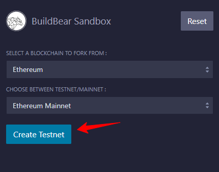

Click "Create Testnet" to generate your Private Sandbox. Wait for a few seconds. Once live, your sandbox details should appear as shown below.

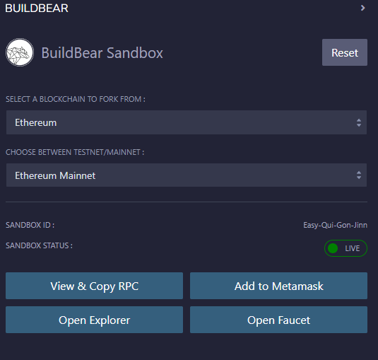

### **Step 3: Explore Sandbox Options**

Now that your sandbox is set up, let's take a look at the options:

**a) View & Copy RPC:**

This grants you access to your Sandbox RPC, necessary for connecting your sandbox to other development tools such as Foundry and Hardhat. Simply copy and paste it into your project's configuration file to deploy and interact with contracts on your Sandbox.

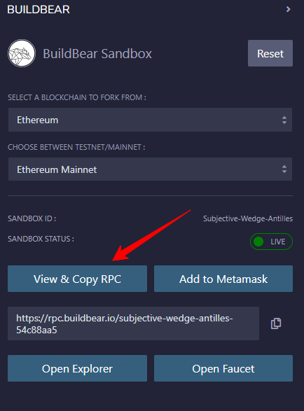

**b) Add to MetaMask:**

Use this option to add your sandbox network to your MetaMask wallet. This allows you to easily sign transactions from your wallet to your private Sandbox.

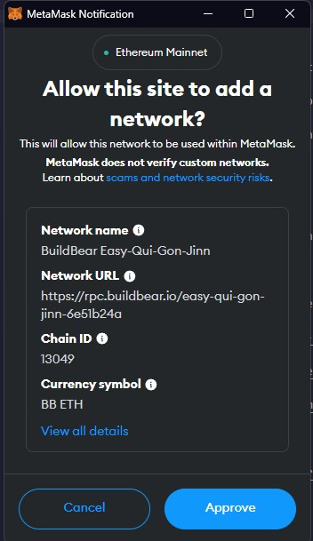

**c) Open Faucet:**

Click "Open Faucet" to visit your sandbox's faucet. Here, you can freely mint both Native tokens (needed for network gas fees) and popular ERC20 tokens.

**d) Open Explorer:**

You can see all the transactions that have happened, interact with deployed contracts, and even trace the execution of transactions to debug them.

### **Step 4: Deploy Your Contract:**

There are two ways to deploy your contract to your BuildBear Sandbox:

**a) Using MetaMask:**

1. **Connect MetaMask:** Go to the **"DEPLOY & RUN TRANSACTIONS"** section and choose **"Injected Provider"** as the environment. This connects your MetaMask wallet to Remix, allowing you to deploy and sign contracts directly from MetaMask.

   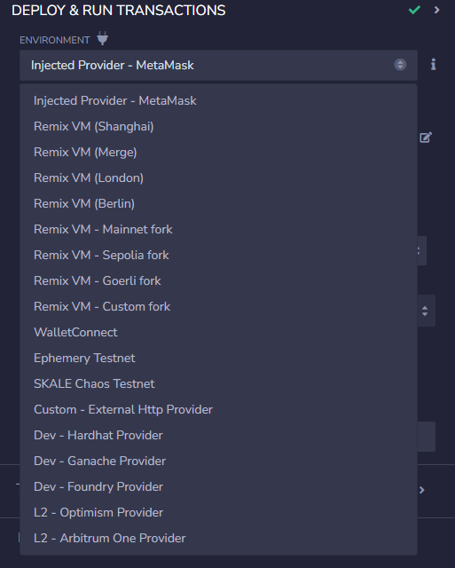

2. **Deploy and Sign:** Select the contract you want to deploy, click **"deploy"**, and confirm the transaction on your MetaMask wallet.

   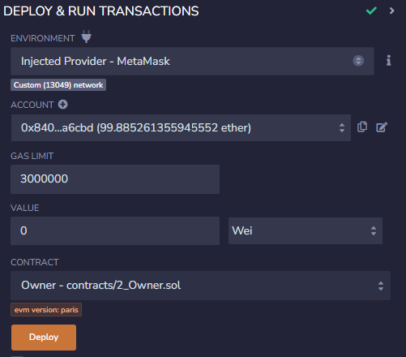

   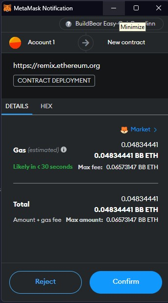

   Once deployed, you can read and write the contract directly from Remix.

   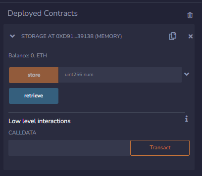

**b) Using a Custom External HTTP Provider:**

1. **Connect Provider:** In the **"DEPLOY & RUN TRANSACTIONS"** section, choose **"Custom- External HTTP Provider"** as the environment. Then, paste your Sandbox's RPC URL.

   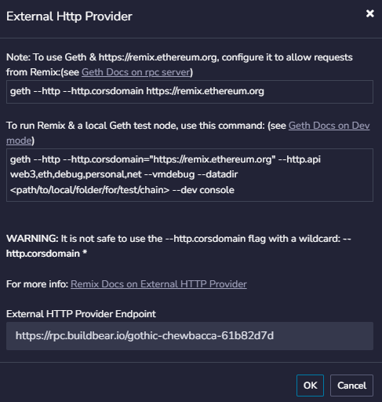

2. **Deploy with Sandbox Account:** Select the contract and click **"deploy"**. The Sandbox's unlocked account will automatically be used for deployment and signing transactions.

   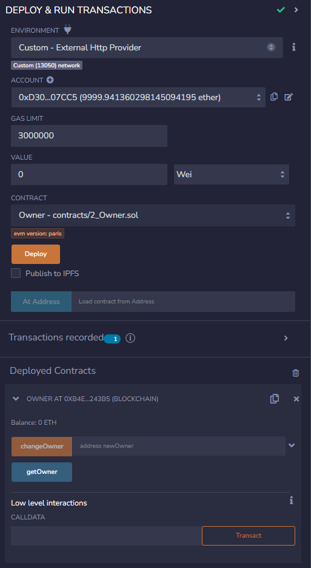

### **Step 5: Submitting the Contract's ABI**

You can interact with your deployed contract: directly through Remix or using Explorer. **However, using the explorer requires submitting the contract's ABI (Application Binary Interface) first.**

Here's how to do it:

1. **Get the ABI:** Go to the Solidity Compiler tab in Remix and copy the deployed contract's ABI.

   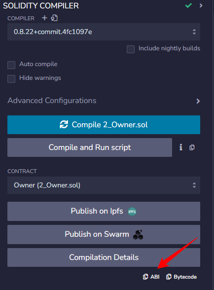

2. **Submit the ABI to the Explorer:** Go to the contract page on your sandbox Explorer. Paste the copied ABI into the designated field as shown below.

   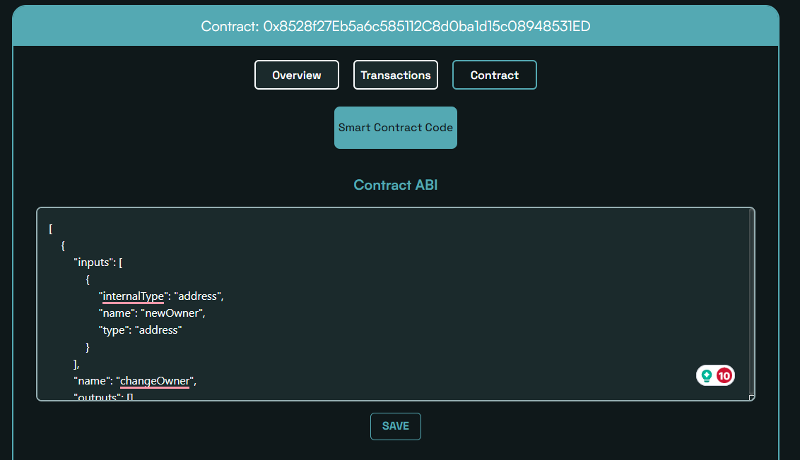

3. **Interact with the Contract:** Once the ABI is submitted, you can use the contract's read-and-write functions similar to how you would on Etherscan.

   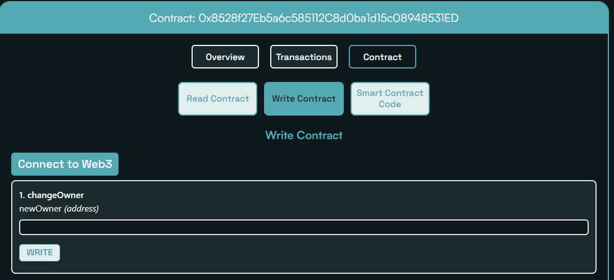

_To create a new Sandbox, click the "Reset" button as shown below. This action will remove the current Sandbox details and will provide options to create a new Sandbox._

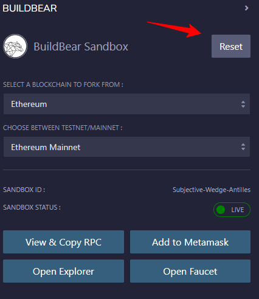

**_If you are facing any issues, feel free to report them to us at [team@buildbear.io](mailto:team@buildbear.io) or through our Chat Bot._**
