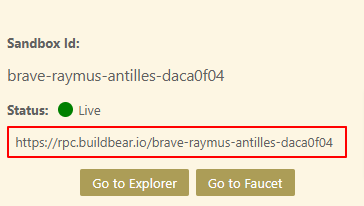
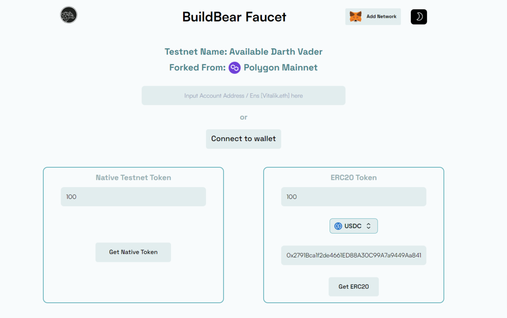
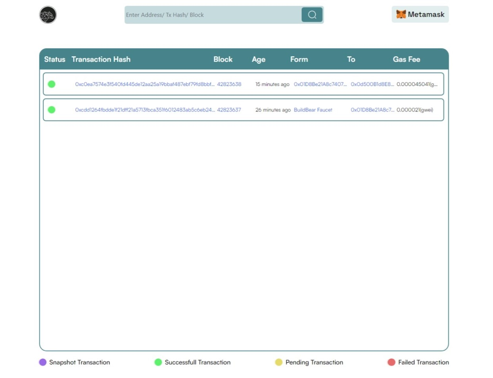

# BuildBear VSCode Extension

The BuildBear VSCode Extension allows you to create a Private sandbox for various EVM and EVM-compatible blockchain networks, complete with a private faucet and Explorer.

### Key Features:

- **Private Faucet:** Enjoy an exclusive faucet for unlimited Native and ERC20 token minting.
- **Rapid Transactions:** Experience swift transactions on BuildBear Sandbox, completing in under 3 seconds.
- **Built-In Explorer:** Effortlessly debug transactions within your sandbox using the integrated explorer and transaction tracer.

### **Step 1: Install the BuildBear Extension**

.png>)

- Open the Extensions MarketPlace.
- Search for "BuildBear".
- Click "Install" on the BuildBear Extension.

### **Step 2: Create your BuildBear Sandbox:**

Choose the blockchain network you want to create your sandbox from.

.png)

Click "Create" to generate your Private Sandbox. Wait for a few seconds. Once live, your sandbox details should appear as shown below.

.png)

### **Step 3: Explore Sandbox Options**

Now that your sandbox is set up, let's take a look at the options:

**a) RPC:**

This is your Sandbox RPC, necessary for connecting your sandbox to other development tools such as Foundry and Hardhat. Simply copy and paste it into your project's configuration file to deploy and interact with contracts on your Sandbox.



**b) Go to Faucet:**

Click "Go to Faucet" to visit your sandbox's faucet. Here, you can freely mint both Native tokens (needed for network gas fees) and popular ERC20 tokens.



**c) Go to Explorer:**

You can see all the transactions that have happened, interact with deployed contracts, and even trace the execution of transactions to debug them.



### **Step 4: Deploy and verify Your Contracts:**

### Through Hardhat

Following are the instructions for you to update your `hardhat.config.js` or `hardhat.config.ts` file to be able to deploy and verify your smart contracts programmatically.

#### (a) Add BuildBear to your Networks

Add a new object `buildbear` in the `networks` object in your `hardhat.config.js` or `hardhat.config.ts`; similar to the following:

```json
networks: {
  buildbear: {
    url: "https://rpc.buildbear.io/Sandbox_ID",
  }
}
```

#### (b) Add a Custom Chain to the Etherscan Object

Add a new object `customChain` in the `etherscan` similar to the following:

```json
etherscan: {
	apiKey: {
		buildbear: "verifyContrats"
	}
  customChains: [
    {
      network: "buildbear",
      chainId: CHAIN_ID,
      urls: {
        apiURL:"https://rpc.buildbear.io/verify/etherscan/Sandbox_ID",
        browserURL: "https://explorer.buildbear.io/node/Sandbox_ID",
      },
    },
  ],
}
```

### Through Foundry

#### (a) Add BuildBear to your Foundry.toml file

```json
[rpc_endpoints]
buildbear = "https://rpc.buildbear.io/Sandbox_ID"
[etherscan]
buildbear = { key = "verifyContract", url="https://rpc.buildbear.io/verify/etherscan/Sandbox_ID" }
```

#### (b) To deploy and verify contracts using scripts, employ the following command:

```json
forge script script/<SCRIPT_NAME>.s.sol --rpc-url buildbear --private-key "<PRIVATE_KEY>"  --etherscan-api-key "verifyContract" --verifier-url "https://rpc.buildbear.io/verify/etherscan/Sandbox_ID" -vvvv --broadcast --verify --slow
```

**_If you are facing any issues, feel free to report them to us at [team@buildbear.io](mailto:team@buildbear.io) or [Telegram](https://t.me/Web3_dApp_Developers)._**
