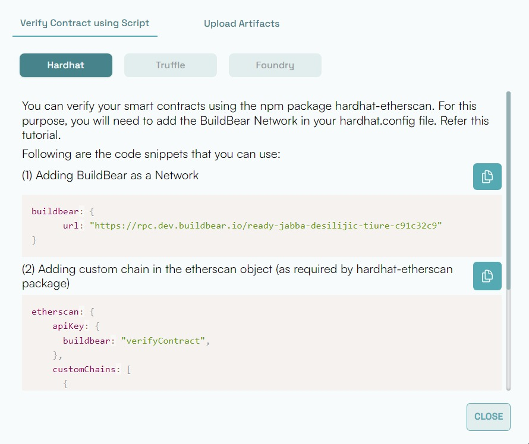

# Contract Verification on BuildBear using Hardhat

Following are the instructions for you to update your `hardhat.config.js` or `hardhat.config.ts` file to be able to deploy and verify your smart contracts programmatically.  

NOTE: All the necessary code snippets that you will need for your hardhat.config file is available for you in your BuildBear dashboard. You just have to copy and paste them.

## Step 1: Add BuildBear to your Networks

Add a new object `buildbear` in the `networks` object in your `hardhat.config.js` or `hardhat.config.ts`; similar to the following:

```json
// CUSTOMIZED CODE SNIPPET AVAILABLE IN YOUR DASHBOARD
networks: {
  buildbear: {
    url: "https://rpc.buildbear.io/Cultural_Lando_Calrissian_af374758",  
		accounts: ["Add Private Key Here"],
  }
}
```

## Step 2: Add a Custom Chain to the Etherscan Object

Add a new object `customChain` in the `etherscan` similar to the following:

```json
// CUSTOMIZED CODE SNIPPET AVAILABLE IN YOUR DASHBOARD
etherscan: {
	apiKey: {
		buildbear: "verifyContrats"
	}
  customChains: [
    {
      network: "buildbear",
      chainId: 8120,
			// Insert the ChainId received from BuildBear Dashboard
      urls: {
        apiURL:"https://rpc.buildbear.io/verify/etherscan/Zealous_Quarsh_Panaka_a3f640f8",
        browserURL: "https://explorer.buildbear.io/node/Zealous_Quarsh_Panaka_a3f640f8",
      },
    },
  ],
}
```

That is it.  Once the above is done, run your scripts to deploy and verify your smart contracts programmatically on BuildBear.

NOTE: Your dashboard should provide the code snippets.  Sample screenshots below: 



## If you are facing any issues with BuildBear, feel free to report them to us at **[team@buildbear.io](mailto:team@buildbear.io)**