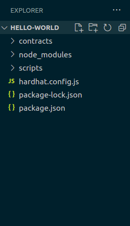
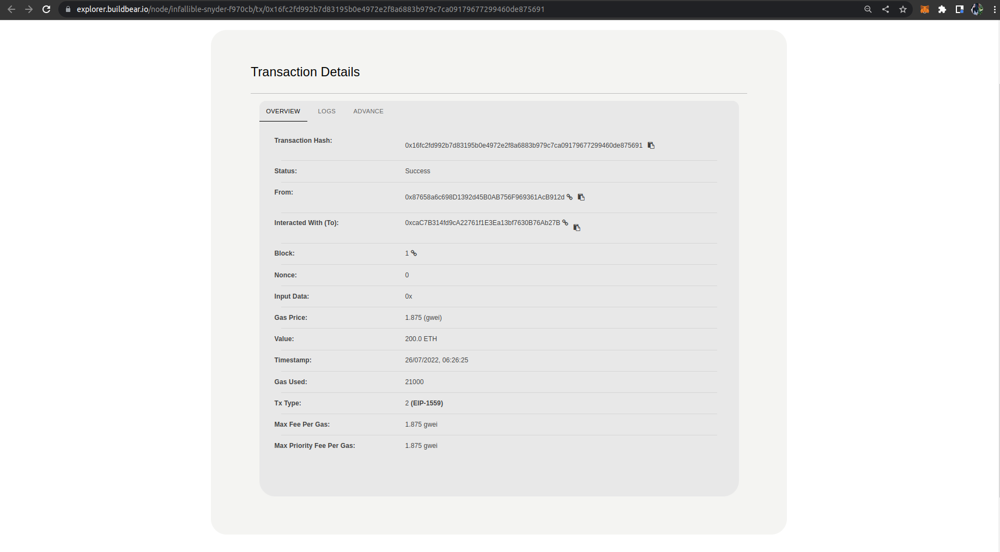

# Creating and Deploying your first smart contract with BuildBear

There are a lot of people out there who are exploring web3 and blockchain. They might be confused about where to start. Therefore, this article is for you if you’re an ABSOLUTE beginner to the blockchain.

By the end of this article, we will understand how can we make our own smart contract using Solidity, deploy our code on the local network, and interact with it.

### *Tools we will be using:*

- **Node Provider:** Node Provider is a tool that makes it very easy to get your smart contract from your local development into the blockchain.

There are a number of node providers out there like **Alchemy**, **Infura**, and **Quicknode**. 

For our smart contract, we are going to use BuildBear, as it also provides a free tier that allows us to make a certain number of requests each day and is easy to use.

- **MetaMask:** MetaMask is a **virtual wallet** that allows us to interact with our blockchain. It consists of the main network and various test networks like Ropsten, Rinkeby, and Kovan and local network.

We are able to test our smart contract using the MetaMask and can deploy it to our blockchain.

- **Hardhat:** Hardhat is a free development tool used for the purpose of testing and deploying our smart contract.

A popular alternative to Hardhat is Truffle. If you’re familiar with truffle, try checking out [this video](https://youtu.be/5Ly4rvV5kTw).

Make sure before going any further, you should create an account on [Alchemy](https://www.alchemy.com/) and [MetaMask](https://chrome.google.com/webstore/detail/metamask/nkbihfbeogaeaoehlefnkodbefgpgknn?hl=en), which we will be going to use later in your project.

# 1. Initialize the project

To begin writing our first smart contract, open your terminal shell, make a directory and then initialize it using the `npm init` command.

.png)

You might be able to see a new file created with the name of *package.json.*

Next, we are going to install Hardhat as a dev-dependency inside our *hello-world* directory. 

To learn more about Hardhat, [click here](https://hardhat.org/getting-started/).

```jsx
npm install --save-dev hardhat
```

Once Hardhat is installed, we will initialize it by using the command.

```jsx
npx hardhat
```

Hardhat provides us with various options, either we could start from scratch, writing our own smart contract and scripts or we could use a sample project to start with.

.png)

Create an *empty hardhat.config.js file* which we will be customizing on our own.

- Create contracts and scripts folder, which will contain our smart contract and deploy script.

```jsx
mkdir contracts
mkdir scripts
```

Our folder structure might look like:



# 2. Write our Smart Contract

Navigate to the ‘**contracts**’ folder and create a file ***helloworld.sol.***

Below is a sample Hello World smart contract from the [Ethereum Foundation](https://ethereum.org/en/)
that we will be using for this tutorial.

```jsx
// SPDX-License-Identifier: MIT
// Specifies the version of Solidity, using semantic versioning.
// Learn more: https://solidity.readthedocs.io/en/v0.5.10/layout-of-source-files.html#pragma
pragma solidity >=0.8.0;

// Defines a contract named `HelloWorld`.
// A contract is a collection of functions and data (its state). Once deployed, a contract resides at a specific address on the Ethereum blockchain. Learn more: https://solidity.readthedocs.io/en/v0.5.10/structure-of-a-contract.html
contract HelloWorld {

   //Emitted when update function is called
   //Smart contract events are a way for your contract to communicate that something happened on the blockchain to your app front-end, which can be 'listening' for certain events and take action when they happen.
   event UpdatedMessages(string oldStr, string newStr);

   // Declares a state variable `message` of type `string`.
   // State variables are variables whose values are permanently stored in contract storage. The keyword `public` makes variables accessible from outside a contract and creates a function that other contracts or clients can call to access the value.
   string public message;

   // Similar to many class-based object-oriented languages, a constructor is a special function that is only executed upon contract creation.
   // Constructors are used to initialize the contract's data. Learn more:https://solidity.readthedocs.io/en/v0.5.10/contracts.html#constructors
   constructor(string memory initMessage) {

      // Accepts a string argument `initMessage` and sets the value into the contract's `message` storage variable).
      message = initMessage;
   }

   // A public function that accepts a string argument and updates the `message` storage variable.
   function update(string memory newMessage) public {
      string memory oldMsg = message;
      message = newMessage;
      emit UpdatedMessages(oldMsg, newMessage);
   }
}
```

This smart contract stores a message when created and the message can be updated using the update function.

If you’re new to solidity, try learning through their [documentation](https://docs.soliditylang.org/en/v0.8.13/).

# 3. Customize the hardhat.config.js file

We will integrate our BuildBear RPC URL and MetaMask Private key inside *hardhat.config.js.*

- For the RPC URL, follow the [Getting Started](https://www.notion.so/Getting-Started-8e561563dd2e410c969874ba3c1684ee) Guide and copy your RPC URL.
- Follow [these instructions](https://metamask.zendesk.com/hc/en-us/articles/360015289632-How-to-Export-an-Account-Private-Key) to export your private key

We are going to use `.env` file to store the RPC URL and MetaMask Private Key.

Make sure you install *dotenv* in your project locally.

```jsx
npm install dotenv --save
```

Create a ***.env* file** and store your API URL and Private Key in it.

.png)

- Install *Ether.js library* which makes it easier to interact which the Ethereum blockchain.

```jsx
npm install --save-dev @nomiclabs/hardhat-ethers "ethers@^5.0.0"
```

Inside the *hardhat.config.js file,* we will be using all these plugins and keys. 

The updated file might look like:

.png)

# 4. Deploy our smart contract

To check whether our smart contract works just fine, we will be compiling it using the terminal shell and running the *compile* command*.*

```jsx
npx hardhat compile
```

.png)

- Since now our smart contract and its configuration are good to go, we will be writing a deploy script which is mandatory in order to deploy our smart contract.

Create a file inside **scripts > deploy.js**

*deploy.js:*

```jsx
async function main() {
    // helloWorld is a factory for instances of our hello world contract
    const HelloWorld = await ethers.getContractFactory("helloWorld");
 
    // deploy() will strat the deployment and will return a Promise that resolves to a Contract object
    const helloWorld = await HelloWorld.deploy("Hello World!");
    console.log("Contract deployed to address:", helloWorld.address);
 }
 
 // ensures the code is clean 
 main()
   .then(() => process.exit(0))
   .catch(error => {
     console.error(error);
     process.exit(1);
   });
```

Here, we are making an instance of our hello world smart contract and using the *deploy()* function to deploy it on the blockchain.

Finally, we are going to deploy our smart contract! 

In order to do so, run the following command in your CLI.

```jsx
npx run scripts/deploy.js --network ropsten
```

We have provided a flag *network* in order to use the ropsten network, if we do not provide the network, the smart contract will be deployed on the hardhat network, by default.

Congratulations! You have deployed your first smart contract.

You may see the results like: 

.png)

To learn more about your deployed smart contract, open [BuildBear Explorer](https://explorer.buildbear.io/)



Here, you can see the information regarding your transaction. 

You can check the **Timestamp** of the contract deployment, the gas price used, and many more information. 

In order to see under the hood, go through the Alchemy Dashboard, where you might see a bunch of JSON-RPC calls made by our smart contract. 

That’s all for part-1 of this tutorial. In further parts, we will see how can we mint our own ‘NFT’.

And feel free to share your first experience with us on writing your first smart contract. 

## If you are facing any issues with BuildBear, feel free to report them to us at **[team@buildbear.io](mailto:team@buildbear.io)**