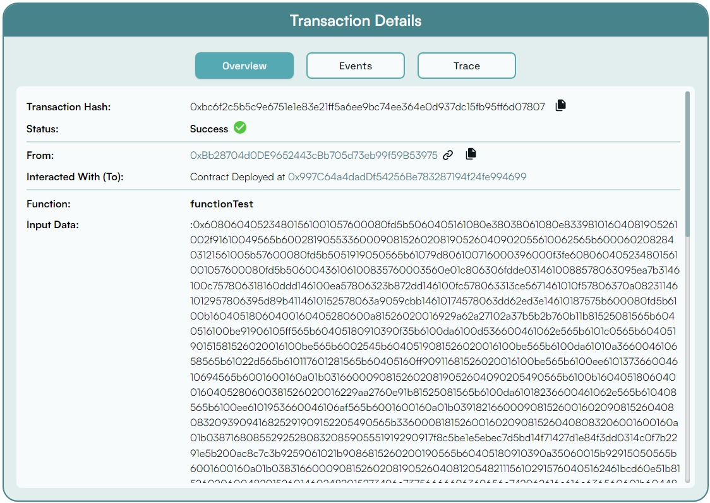

# Creating and Deploying your smart contract with BuildBear


### Tools we will be using:

- **Hardhat:** Hardhat is a free development tool used for the purpose of testing and deploying our smart contract.

## 1. Initialize the project

To begin writing our first smart contract, open your terminal shell, make a directory and then initialize it using the `npm init` command.

.png)

You might be able to see a new file created with the name of *package.json.*

Next, we are going to install Hardhat as a dev-dependency inside our *hello-world* directory. 

To learn more about Hardhat, [click here](https://hardhat.org/getting-started/).

```jsx
npm install --save-dev hardhat
```

Once Hardhat is installed, we will initialize it by using the command.

```jsx
npx hardhat
```

Hardhat provides us with various options, either we could start from scratch, writing our own smart contract and scripts or we could use a sample project to start with.

.png)

Create an *empty hardhat.config.js file* which we will be customizing on our own.

- Create contracts and scripts folder, which will contain our smart contract and deploy script.

```jsx
mkdir contracts
mkdir scripts
```

Our folder structure might look like:


## 2. Write the Smart Contract

Navigate to the ‘**contracts**’ folder and create a file ***helloworld.sol.***

Below is a sample Hello World smart contract from the [Ethereum Foundation](https://ethereum.org/en/)
that we will be using for this tutorial.

```jsx
// SPDX-License-Identifier: MIT
// Specifies the version of Solidity, using semantic versioning.
// Learn more: https://solidity.readthedocs.io/en/v0.5.10/layout-of-source-files.html#pragma
pragma solidity >=0.8.0;

// Defines a contract named `HelloWorld`.
// A contract is a collection of functions and data (its state). Once deployed, a contract resides at a specific address on the Ethereum blockchain. Learn more: https://solidity.readthedocs.io/en/v0.5.10/structure-of-a-contract.html
contract HelloWorld {

   //Emitted when update function is called
   //Smart contract events are a way for your contract to communicate that something happened on the blockchain to your app front-end, which can be 'listening' for certain events and take action when they happen.
   event UpdatedMessages(string oldStr, string newStr);

   // Declares a state variable `message` of type `string`.
   // State variables are variables whose values are permanently stored in contract storage. The keyword `public` makes variables accessible from outside a contract and creates a function that other contracts or clients can call to access the value.
   string public message;

   // Similar to many class-based object-oriented languages, a constructor is a special function that is only executed upon contract creation.
   // Constructors are used to initialize the contract's data. Learn more:https://solidity.readthedocs.io/en/v0.5.10/contracts.html#constructors
   constructor(string memory initMessage) {

      // Accepts a string argument `initMessage` and sets the value into the contract's `message` storage variable).
      message = initMessage;
   }

   // A public function that accepts a string argument and updates the `message` storage variable.
   function update(string memory newMessage) public {
      string memory oldMsg = message;
      message = newMessage;
      emit UpdatedMessages(oldMsg, newMessage);
   }
}
```

This smart contract stores a message when created and the message can be updated using the update function.

If you’re new to solidity, try learning through their [documentation](https://docs.soliditylang.org/en/v0.8.13/).

## 3. Customize the hardhat.config.js file

- Follow the instructions provided in the **Getting Started** section to create a BuildBear Testnet Sandbox and incorporate the details into the *hardhat.config.js* file.


- Install *Ether.js library* which makes it easier to interact which the blockchain.

```jsx
npm install --save-dev @nomiclabs/hardhat-ethers "ethers@^5.0.0"
```
- Install *hardhat-etherscan library* which makes it easier to verify contract on Etherscan Explorer.

```jsx
npm install --save-dev @nomiclabs/hardhat-etherscan
```


Inside the *hardhat.config.js file,* we will be using all these plugins. 

The updated file might look like:

```jsx
require("@nomicfoundation/hardhat-toolbox");
require("@nomiclabs/hardhat-etherscan");

module.exports = {
  solidity: "0.8.10",
   defaultNetwork: "buildbear",
   networks: {
    buildbear: {
      url: //rpc Url from BuildBear Dashboard
    }
   },
  etherscan: { // copy the Etherscan object from the verify Contracts secion on Dashboard 
    apiKey: {
      buildbear: "verifyContract",
    },
    customChains: [
      {
        network: "buildbear",
        chainId: 1,
        urls: {
          apiURL: "https://rpc.buildbear.io/verify/etherscan/buildbear",
          browserURL: "https://explorer.buildbear.io/buildbear",
        },
      },
    ],
  },
};
```

## 4. Deploy the smart contract

To check whether our smart contract works just fine, we will be compiling it using the terminal shell and running the *compile* command*.*

```jsx
npx hardhat compile
```

.png)

- Since now our smart contract and its configuration are good to go, we will be writing a deploy script which is mandatory in order to deploy our smart contract.

Create a file inside **scripts > deploy.js**

*deploy.js:*

```jsx
const { ethers } = require("hardhat");

async function main() {
    // helloWorld is a factory for instances of our hello world contract
    const HelloWorld = await ethers.getContractFactory("helloWorld");
 
    // deploy() will strat the deployment and will return a Promise that resolves to a Contract object
    const helloWorld = await HelloWorld.deploy("Hello World!");
    console.log("Contract deployed to address:", helloWorld.address);
 }
 
 // ensures the code is clean 
 main()
   .then(() => process.exit(0))
   .catch(error => {
     console.error(error);
     process.exit(1);
   });
```

Here, we are making an instance of our hello world smart contract and using the *deploy()* function to deploy it on the blockchain.

Finally, we are going to deploy our smart contract! 

In order to do so, run the following command in your CLI.

```jsx
npx run scripts/deploy.js
```

We have provided a flag *network* in order to use the ropsten network, if we do not provide the network, the smart contract will be deployed on the hardhat network, by default.

Congratulations! You have deployed your first smart contract.

You may see the results like: 

.png)

To learn more about your deployed smart contract, open [BuildBear Explorer](https://explorer.buildbear.io/)



Here, you can see the information regarding your transaction. 

You can check the **Timestamp** of the contract deployment, the gas price used, and many more information.  

## If you are facing any issues with BuildBear, feel free to report them to us at **[team@buildbear.io](mailto:team@buildbear.io)**