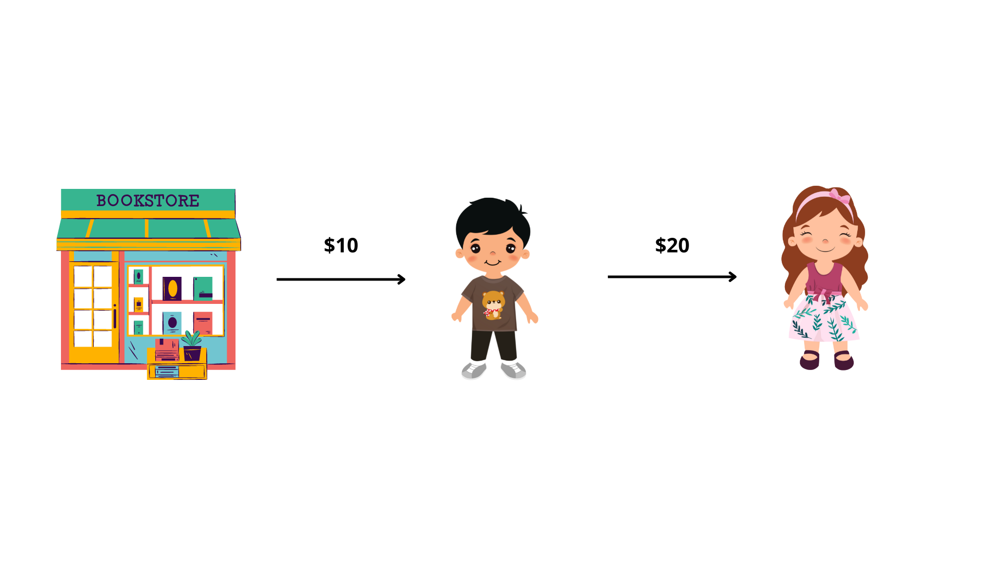
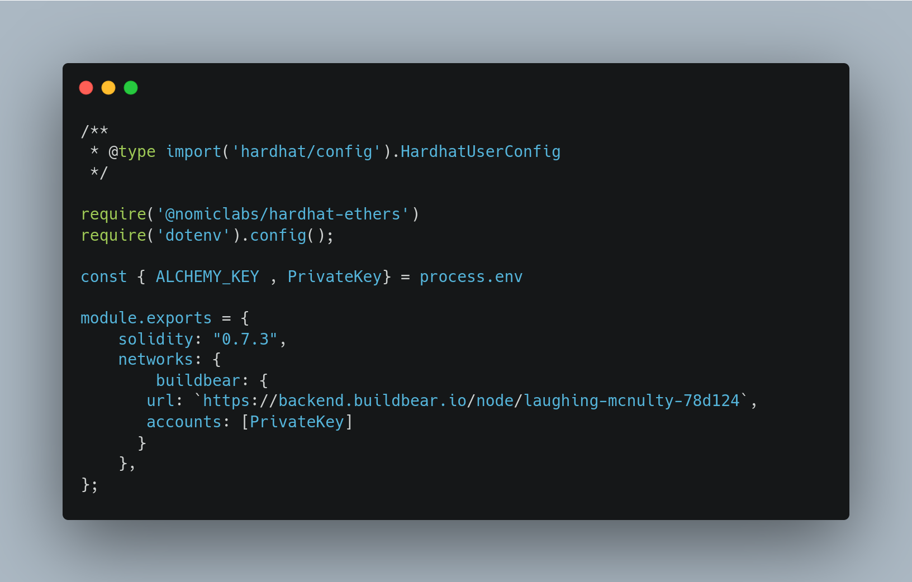
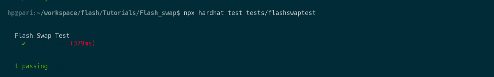

# Flash Swap ⚡

In the tutorial [Uniswap 🔀 Testing](https://www.notion.so/Uniswap-Testing-c72f1061b23d45eb94b5e13846718f33) , we understood how we can implement a swap between tokens using Uniswap. 

In this article, we will be moving one level ahead by exploring **Flash Swap by coding a flash swap** contract and run tests on it! 

*We highly recommend you go through the previous article before.* 

### What is a Flash Loan?

Unlike Traditional Loans, in Flash Loans, funds are borrowed and returned in **one transaction**.  This is a MUST. 

In **Defi,** traders (usually through bots) keep looking out for arbitrage opportunities to gain benefits by trading between platforms supplying different prices for the same asset. 

This is where the Flash Loans comes into the picture (albeit usually). 

With the help of **Flash Loan**, traders can borrow a large sum of money to execute an arbitrage trade.

### How does Flash Loan Arbitrage work?



Consider a situation, where Ethan buys a book for $10 from the Bookstore and then sells that book to Jennifer for $20. In this situation, Ethan buys a book using his money and then straight away doubles it by selling it to Jennifer.

This is exactly how trading arbitrage works. 

But unlike Ethan, who used his own money for buying the book from the bookstore, here we could simply use Flash Loans to borrow $10 and then execute a trade, similar to selling the book and then repay the loan (yes, all in 1 single transaction). 

Lets dive in coding our own Flash swap contract and test it out!! 😎

## 1. Create a project and install dependencies

Use the following commands on your CLI to initialize your project.

```jsx
mkdir Flash_swap && cd Flash_swap
npm init -y
```

 

Now, install the required dependencies that we’ll be using for the project. 

Use the command provided below and run it on your CLI to install them.

```jsx
npm install --save hardhat @nomiclabs/hardhat-ethers @nomiclabs/hardhat-waffle ethers @uniswap/v2-core dotenv hardhat chai
```

## 2. Initialize your Hardhat Project

Run the command `npx hardhat` on your CLI and create an empty hardhat config file, since we’re going to build everything from scratch. 

Customize your hardhat config:

Because we are going to fork the mainnet to test the Flashswap. Therefore, your hardhat config should look something similar to this:



Also, if you’re new to mainnet forking, read [Fork 🍴the F*ing Mainnet! Do a transaction from Vitalik’s Account ;) ](https://www.notion.so/Fork-the-F-ing-Mainnet-Do-a-transaction-from-Vitalik-s-Account-01c47af9e7d84060812007f26f33a7d9) and then follow along with this article. 

We are going to use BuildBear for our testing purposes: Refer to the [Getting Started](https://www.notion.so/Getting-Started-8e561563dd2e410c969874ba3c1684ee) Guide on how to use BuildBear.

## 3. Write a smart contract for Flash swap

Create directories for contracts and tests for better code organisation.

Use the following code in your CLI.

```jsx
mkdir contracts && mkdir tests
```

In order to write the flash swap contract, create a file inside the contracts directory and name it `flashswap.sol`

***Writing the smart contract:***

First, import the interfaces required and create a contract named as `flashSwap`.

We will import **Uniswap’s interface** to use its functions. You can get the interface using this [link](https://github.com/UV-Labs/Tutorials/blob/main/Flash_swap/contracts/interfaces/Uniswap.sol).

We have also imported **IUniswapV2Callee** interface. Uniswap will call this function when we execute the flash swap.  Technically this is the callback function that Uniswap will call.

It should look similar to this:

.png)

Next, we create our contract **flashSwap** which inherits from **IUniswapV2Callee**.  Solidity supports inheritance between smart contracts, where multiple contracts can be inherited into a single contract. The contract from which other contracts inherit features is known as a base contract, while the contract which inherits the features is called a derived contract.

This contract will have 2 functions:

- **testFlashSwap()**: This is the function we will use to call to trigger the flash swap transaction.
- **uniswapV2Call():** This is the function that the Uniswap

.png)

*Writing the **testFlashSwap** function:*

This function will take 2 parameters (A) the token that is to be borrowed from Uniswap {the address| and (B) the amount we want to borrow.

- First thing that we’ll do is, check that the pair contract for _*tokenBorrow* and *WETH* exists. We can do that by calling the *getPair* function on *UniswapV2Factory
NOTE: In Uniswap v2, all token pairs are with WETH as of of the coin and hence, to check if a particular token is available on Uniswap, we simply check its availability with WETH.  More on what is WETH —>* [https://weth.io/](https://weth.io/)

```jsx
address pair = IUniswapV2Factory(UniswapV2Factory).getPair(_tokenBorrow, WETH);
require(pair != address(0), "!pair");
```

*{Please note, we have defined WETH as a variable in our contract already.  Please refer to our entire contract at the end}*

Inside the UniswapV2Pair, we have 2 tokens, **token0,** and **token1**. 

We now will check if *_tokenBorrow* is equal to *_token0* or not. 

If the values are equal, then **amount0Out** will be the _amount argument that we pass to the function, otherwise, it would be equal to zero. 

Similarly, we will check the same for _*token1.* 

```jsx
address token0 = IUniswapV2Pair(pair).token0();
address token1 = IUniswapV2Pair(pair).token1();
uint256 amount0Out = _tokenBorrow == token0 ? _amount : 0;
uint256 amount1Out = _tokenBorrow == token1 ? _amount : 0;
```

As a result, either you’ll have **amount0Out** equal to _amount and **amount1Out** equal to 0 or vice-versa. 

Then we pass these amount values in Uniswap’s swap function. 

```jsx
bytes memory data = abi.encode(_tokenBorrow, _amount);
IUniswapV2Pair(pair).swap(amount0Out, amount1Out, address(this), data);
```

As you’ll notice, this is the exact same function that we call to perform a simple swap on Uniswap. Refer to our previous article over [here.](https://medium.com/uv-labs/uniswap-testing-1d88ca523bf0)

The only difference is the last input. If it is empty, then Uniswap will try a simple swap execution. 

If it is not empty, that is it has any data, then it would trigger a **flashswap.**

To pass in the input, we will encode the *tokenBorrow* and *amount* as bytes and then pass it to the swap function. 

The **testFlashSwap** function should look similar to: 

.png)

*Let’s write the **uniswapV2Call:** 🤩*

- *Basic housekeeping:* Right now, anyone can access this function, therefore the first thing that we’re going to do is check that this function can only be called by the pair contract. 
And then, we’ll also check that the sender is equal to the pair contract.
For that, use the following code:

```jsx
address token0 = IUniswapV2Pair(msg.sender).token0();
address token1 = IUniswapV2Pair(msg.sender).token1();
// call uniswapv2factory to getpair 
address pair = IUniswapV2Factory(UniswapV2Factory).getPair(token0, token1);
require(msg.sender == pair, "!pair");
```

- *Decoding data:* Then, we will decode the data that is passed to us by Uniswap, this is not a mandatory step, but encouraged to do so.

```jsx
(address tokenBorrow, uint amount) = abi.decode(_data, (address, uint));
```

- *Computing fee:* Uniswap charges 0.3% for any form of swap. Using the following code, we are computing the fee that our contract will have to bear for undertaking the flashswap.

```jsx
uint fee = ((amount * 3) / 997) + 1;
uint amountToRepay = amount + fee;
```

- *Repayment:* Lastly, we have to pay Uniswap the borrowed token including the fee. It can be achieved by using the following code.

```jsx
IERC20(tokenBorrow).transfer(pair, amountToRepay);
```

That completes our **uniswapV2Call** function, which would look similar to the following image: 

.png)

Now, our flashSwap contract is complete, and should be similar to this: 

.png)

## 4. Let’s write some Test Script for our Contract

First of all, we will import the necessary libraries, ERC20 abi, and will also create a basic structure of our test script. 

Use the following reference to get a better understanding: 

.png)

- Now, we will define the address of the contract which we’re going to impersonate and the USDC address.

We will also define the amount that we’re going to borrow.

Use the following: 

```jsx
const USDCHolder = "0x3f5CE5FBFe3E9af3971dD833D26bA9b5C936f0bE";
const USDCAddress = "0xA0b86991c6218b36c1d19D4a2e9Eb0cE3606eB48";
const borrowAmount = 1000000000; // since USDC is 6 decimals, this corresponds to 1000 USDC Coins
```

- Next, we will begin with the `before` block use the contract we created and deploy it.

```jsx
before(async () => {
        const TestFlashSwapFactory = await ethers.getContractFactory("flashSwap");
        TestFlashSwapContract = await TestFlashSwapFactory.deploy();
        await TestFlashSwapContract.deployed();
});
```

- Finally, we write our test script to check our Flash swap execution.
    
    A: First, we will impersonate the account which we want to use: 
    

```jsx
await hre.network.provider.request({
            method: "hardhat_impersonateAccount",
            params: [USDCHolder],
});
const impersonateSigner = await ethers.getSigner(USDCHolder);
```

    B: Then, we will define the USDC Contract

```jsx
const USDCContract = new ethers.Contract(USDCAddress, ERC20ABI, impersonateSigner)
```

    B: We already knew that Uniswap charges a fee to implement a Flash Swap. Therefore, we will calculate the value of the fee. 

```jsx
const fee = Math.round(((borrowAmount * 3) / 997)) + 1;
```

   C: We need to understand that, since our contract just got deployed in the `before` block, it does not have any Ether or any USDC. Then, once the flash loan is  implemented, the contract has to return the borrowed amount plus the fee. 

Therefore, we have to transfer the amount of the fee from the impersonated account to our contract, in order to complete the trade.  

Therefore, we will use the following command to transfer the fee to the contract: 

```jsx
await USDCContract.connect(impersonateSigner).transfer(TestFlashSwapContract.address, fee)
```

   D: Then, we will call the **testFlashSwap** function which we have defined in our contract. 

```jsx
await TestFlashSwapContract.testFlashSwap(USDCContract.address, borrowAmount)
```

   E: It’s time to check whether the Flashswap executed was correct or not. For that, we will check whether the balance of our contract, after the flashswap and the payment of the exact fee that we computed is 0, as it should be, or not. 

```jsx
const TestFlashSwapContractBalance = await USDCContract.balanceOf(TestFlashSwapContract.address)
expect(TestFlashSwapContractBalance.eq(BigNumber.from("0"))).to.be.true;
```

Your final test script should look like this: 

.png)

Finally, run your test in your CLI using the command `npx hardhat test tests/flashswaptest`

The result should look like this: 



***Voila*** 🥳🥳🥳 *****Our* flashswap passed with flying colours 🤣 

### Summary

Flash swap allows you to borrow any ERC20 token on Uniswap and execute any code logic, as long as you repay the same token or any other token of the same value plus the fee **in the same transaction**. 

Hope you like our efforts and try and run this by yourself. :)

Again, all the code that we just ran through is over here 👉 [Github repository](https://github.com/UV-Labs/Tutorials). 

## If you are facing any issues with BuildBear, feel free to report them to us at **[team@buildbear.io](mailto:team@buildbear.io)**