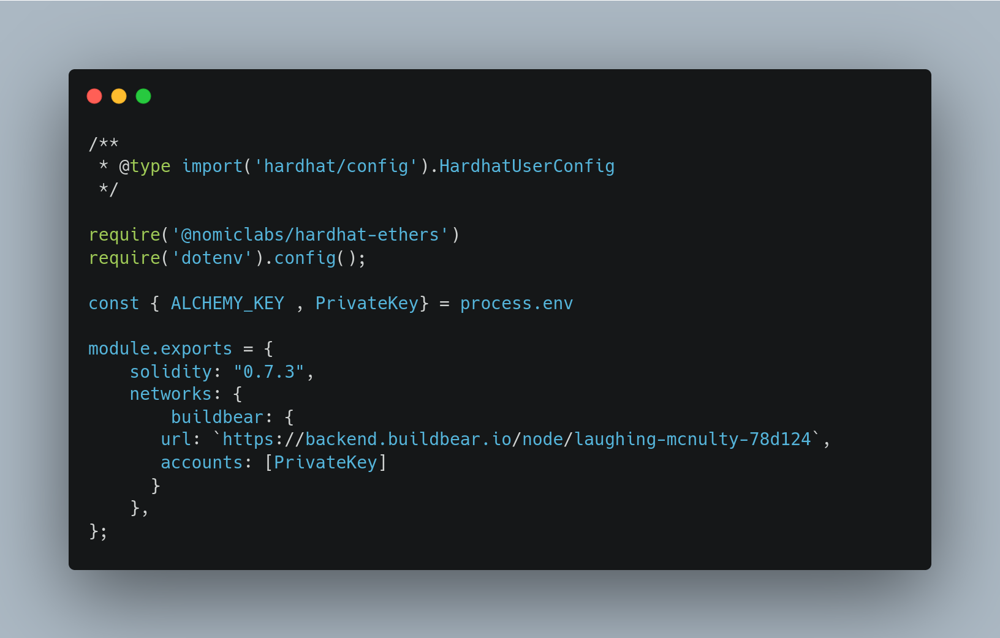

# Forking Mainnet! Do a transaction from Vitalik’s Account 

> Creating a copy of something that already exists is known as
> 
> 
> **Forking**
> 

In Blockchain, forking the Ethereum mainnet (or for that matter any testnet) locally means having a copy of the main Ethereum blockchain running on our local computer. *Pro tip: there is literally 0 sense for you to fork a testnet; should you think otherwise; let us know.*

When we fork 🍴 the mainnet, we have the current state of the blockchain running locally on our system, including all contracts deployed on it and all transactions performed on it.

💣 we have the F*ing mainnet right in our local node; isn’t that 🆒 ?

### Why do we need forking?

When working on projects requires interaction with contracts that are already deployed on the mainnet (and obviously the state that they have), forking the mainnet is practically the ONLY feasible option .

Honestly, we have 2 options for testing:

1. Creating a mock which executes all the necessary functions of already deployed smart contracts. (But this will not potentially give you the same state.)OR
2. Forking the mainnet.

Creating a mock contract is not the best option because of the following reasons:

- Rewriting the existing contract for testing is not such a great practice; also, sometimes it is not one contract but a suite of contracts; and
- Executing multiple transactions in order to create the same state in our mock environment is really really difficult! *Trust us, it is really difficult!*

### Hardhat and its relationship with Forking

Hardhat allows us to fork the mainnet by updating a few lines of code in our *config file.*

In order to get a better grip on mainnet forking, let us run you through an example, in which we will fork the mainnet and transfer Vitalik’s UNI token to our address 😉 .

💻 Let’s dive into the coding! 💻

### 1. Create a project and initialize it

Use the following commands on your CLI to initialize your project.

```
mkdir Mainnet-Forking && cd Mainnet-Forking
npm init -y
```

Install the required dependencies for the project, run

```
npm install --save hardhat @nomiclabs/hardhat-ethers @nomiclabs/hardhat-waffle ethers
```

### 2. Initialize your Hardhat project

To initialize your Hardhat project, run `npx hardhat` command in your CLI, and create an empty *config.js* file.

### Customize your hardhat.config.js file

We can start an instance of Hardhat Network that forks mainnet. This means that it will simulate having the same state as mainnet, but it will work as a local development network and will allow us to interact with the deployed protocols and test interactions locally.

To execute that update the *hardhat.config.js* to as follows:



For forking the mainnet, create an API URL for main network on Alchemy and then open [BuildBear](https://bit.ly/buildbear-dashboard) and create an endpoint and add the specific block number. Refer to the [Getting Started](https://www.notion.so/Getting-Started-8e561563dd2e410c969874ba3c1684ee) Guide for instructions.

Then copy the BuildBear RPC URL and use it in your Hardhat.config.js file.

Hardhat allows you to specify a block number. This means that the state of the chain will act as if we were at that given block.

### 3. Create a Transfer script

- Create a new folder`scripts` in your root directory, and then create a file inside it, named `transfer.js`
- Create an async function, `main`, and define the ABI.

ABI or Application Binary Interface defines the methods and structures that you can simply use to interact with that binary contract.

Use the following code in your t*ransfer.js* script

```jsx
async function main() {
    const abi = [
    // Read-Only Functions
    "function balanceOf(address owner) view returns (uint256)",
// Authenticated Functions
    "function transfer(address to, uint amount) returns (boolean)",
   ];
}
```

### Magic Time 💫

Now, we’re going to customize the Hardhat Network’s behavior with the help of `hardhat_impersonateAccount`

You can impersonate an address and use some tokens from that address to test your function. In other words, it allows us to act as if we were the owner of the given account.

Hardhat has provided great documentation on `impersonateAccount`.

For our transfer script, we’ll be impersonating [Vitalik’s address](https://etherscan.io/address/0xab5801a7d398351b8be11c439e05c5b3259aec9b) 😎

Use the following code to impersonate his account and assign it as the signer.

```
const vitalik_address = "0xAb5801a7D398351b8bE11C439e05C5B3259aeC9B";
const uniToken_address = "0x1f9840a85d5af5bf1d1762f925bdaddc4201f984";
const my_address = "0xf39Fd6e51aad88F6F4ce6aB8827279cffFb92266";
```

```
    // impersonating vitalik's account
    await hre.network.provider.request({
        method: "hardhat_impersonateAccount",
        params: [vitalik_address],
    });

    const signer = await ethers.getSigner(
        vitalik_address
    );
```

Now, we’ll create an abstraction of the UNI [contract](https://etherscan.io/address/0x1f9840a85d5af5bf1d1762f925bdaddc4201f984) in order to use the transfer function.

In order to execute the transfer function, we need to provide two arguments:

- the address to which we need to transfer the amount
- and, the amount we want to transfer

Use the following code:

```jsx
// uniswap contract
const uniToken = new ethers.Contract(
        uniToken_address,
        abi,
        signer
    );
const vitalik_Balance = (await uniToken.balanceOf(vitalik_address)).toString()
await uniToken.transfer(
        my_address,
        ethers.BigNumber.from(vitalik_Balance)
    );
```

Here, we have defined the variable **vitalik_Balance** which stores the total balance of the UNI token in his wallet. Therefore, we’ll be transferring his entire balance to our account.

To check the balance of UNI Token, in your account, after the transaction is done, add the below code to your *transfer.js.*

```jsx
// uniswap contract
if ((await uniToken.balanceOf(my_address) == vitalik_Balance)) {
        console.log(`Wohoo!! You now have ${ethers.utils.formatEther(vitalik_Balance)} UNI Tokens!`)
    }
```

Then call the main function.

Your final ***transfer.js*** should look similar to:


It’s time to run the script!!! 🥳

Open your CLI and run the following command:

```jsx
npx hardhat run scripts/transfer.js
```

Within a few seconds, you should see the following:


CLI Showing UNI Tokens

You can see that we got a balance of 1615.57647 UNI Tokens in our account (1615576470000000000000 wei, converted to ethers).

Isn’t this amazing!? How we impersonated Vitalik’s account and transferred the token to our address!

In the next article, we’ll continue with mainnet forking and will try swapping the tokens using Hardhat!

Again, all the code that we just ran through is over here 👉 [Github repository](https://github.com/UV-Labs/Tutorials). 

## If you are facing any issues with BuildBear, feel free to report them to us at **[team@buildbear.io](mailto:team@buildbear.io)**