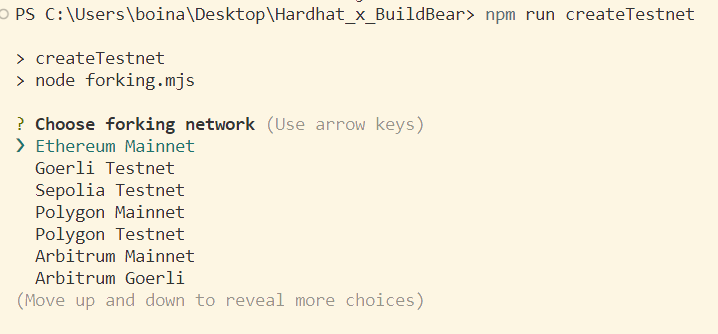
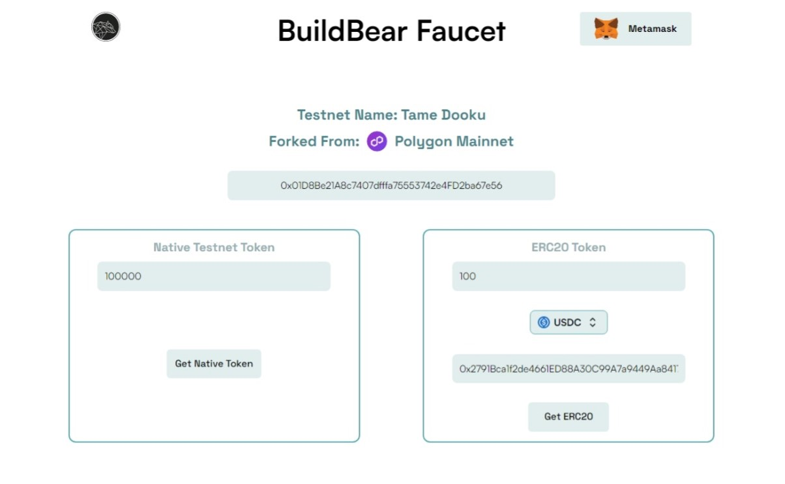

# Hardhat - BuildBear

**Hardhat - BuildBear** lets you create your own private testnet Sandbox, (optional) forked from the mainnet, with your own Native and ERC20 Token faucet and blockchain Explorer from your CLI.

## 🐻 Features of [Hardhat - BuildBear](https://github.com/BuildBearLabs/Hardhat-BuildBear)

### Create your Private Testnet Sandbox



### Use your personal Native & ERC20 Token Faucet



### Use your personal Explorer with built-in Transaction Trace


## 🏄‍♂️ Quick Start

#### 1️⃣ Clone/fork Hardhat-Buildbear:

```bash
git clone https://github.com/BuildBearLabs/Hardhat-BuildBear.git
```

#### 2️⃣ Install dependencies 

```bash
cd Hardhat-BuildBear
npm install
```

#### 3️⃣ Create your private testnet Sandbox(forked from the mainnet):

```bash
npm run createTestnet
```

Once the Testnet is live, its RPC, Explorer and Faucet details are added to the `testnet.json` file

#### 4️⃣ To Deploy the `Greeter.sol` smart contract

```bash
npx hardhat run scripts/deploy-greeter.js
```

#### 5️⃣ To Run the Test script `Greeter-Test.js`

```bash
npx hardhat test
```
# 💬 Support Chat

Join the telegram [support chat 💬](https://t.me/Web3_dApp_Developers)