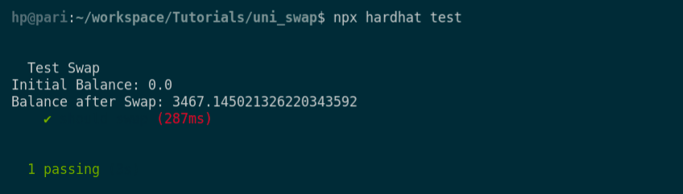

# Uniswap 🔀 Testing

> *Tests validate behaviors within your smart contract. They give you confidence that your code performs in the ways that you intend, and does not perform in the ways that it should not.*
> 

In the previous tutorial [Fork 🍴the F*ing Mainnet! Do a transaction from Vitalik’s Account ;) ](https://www.notion.so/Fork-the-F-ing-Mainnet-Do-a-transaction-from-Vitalik-s-Account-01c47af9e7d84060812007f26f33a7d9) , we learnt about *mainnet forking* and played with Vitalik’s account using *impersonate account.* 

Now we have decided to take this further and test out the [Uniswap’s](https://uniswap.org/) swap implementation. Yes! You heard it correct 😎

### **But before diving into it, let us understand more about Uniswap**

Uniswap is a Decentralized Exchange, running on the Ethereum Blockchain (Mainnet and a few more).  As the name suggests, Uniswap is used for **trading ERC20 tokens**. 

***There are 3 main functionalities of Uniswap:***

1. Swap between different tokens
2. Add liquidity to the market and get rewarded with pair exchange ERC-20 liquidity tokens
3. Burn ERC-20 liquidity tokens and get back the ERC-20 tokens that the pair exchange allows traders to exchange

In this article, we are going to focus on swapping between different tokens using forking.

NOTE: We recommend you go through the [previous part](https://medium.com/uv-labs/fork-the-f-ing-ethereum-blockchain-transfer-tokens-from-vitaliks-account-46d408f7356c) of this article first and then follow along this article to get a better grip on what's happening.

***So let’s get started!*** 🥳🥳

## ****1. Create a project and initialize it****

Use the following commands on your CLI to initialize your project.

```jsx
mkdir uni_swap && cd uni_swap
npm init -y
```

Install the required dependencies for the project, run

```jsx
npm install --save hardhat @nomiclabs/hardhat-ethers @nomiclabs/hardhat-waffle ethers @uniswap/v2-core 
```

## ****2. Initialize your Hardhat project****

To initialize your Hardhat project, run `npx hardhat` command in your CLI, and create an empty *config.js* file.

Customize your hardhat config:

Because we are going to fork the mainnet to test the Uniswap using Alchemy and [BuildBear](https://bit.ly/buildbear-dashboard). Therefore, your hardhat config should look something similar to this:

Refer to the [Getting Started](https://www.notion.so/Getting-Started-8e561563dd2e410c969874ba3c1684ee) guide on how to use [BuildBear](http://buildbear.io)


## 3. Write the smart contract for Swap

Create directories for contracts, scripts, and tests for better code organization. 

Use the following code in your CLI.

```jsx
mkdir contracts && mkdir scripts && mkdir tests
```

In order to write the swap contract, create a file inside the contracts directory and name it `testSwap.sol`

Before writing the contract, we also need to include an interface: Uniswap to use their functions

***Writing the smart contract:*** 

Import the interfaces inside your `testSwap.sol` in order to use them for swapping the tokens. And create a contract named **testSwap**

It should look like this: 

.png)

Now, inside testSwap, we need to include the address of the **Uniswap Router.** It is required for us to do the trade between the tokens.

Use the following code:

```jsx
//address of the uniswap v2 router
address private constant UNISWAP_V2_ROUTER = 0x7a250d5630B4cF539739dF2C5dAcb4c659F2488D;

```

Now, define the function we are going to use for swapping:

```jsx
// swap function
    function swap(
        address _tokenIn,
        address _tokenOut,
        uint256 _amountIn,
        address _to,
        uint256 _deadline
    ) external {

}
```

We have named our function as **swap,** inside that we have

- **_tokenIn** is the address of the token that we are trading in for
- **_tokenOut** is the address of the token we want out of this trade
- **_amountIn** is the amount of tokens we are trading
- **_to** is the address where we are sending the output token
- and **_deadline** is the time during which the transaction should be executed. The transaction will be expired if the deadline time exceeds.

Inside the swap function, the first thing that we’re going to do is transfer the *_tokenIn* address’ amount inside the contract, using `msg.sender`.

```jsx
// transfer the amount in tokens from msg.sender to this contract
IERC20(_tokenIn).transferFrom(msg.sender, address(this), _amountIn);
```

Once this is called, the **_tokenIn** address would have the amount present inside **_amountIn.**

Next, by calling **IERC20** approve you allow the Uniswap contract to spend the **_amountIn** tokens in this contract

```jsx
//by calling IERC20 approve you allow the uniswap contract to spend the tokens in this contract
IERC20(_tokenIn).approve(UNISWAP_V2_ROUTER, _amountIn);
```

Now, one of the parameters we need to call for swapping the tokens is **path.**

So, we will declare an array of addresses named path. 

Address of _tokenIn and the address of _tokenOut.

```jsx
address[] memory path;
path = new address[](2);
path[0] = _tokenIn; // DAI
path[1] = _tokenOut; // WETH
```

We’ll call the ***getAmountsOut***, which is useful for calculating optimal token amounts before calling swap. It takes an input amount and an array of token addresses. 

```jsx
uint256[] memory amountsExpected = IUniswapV2Router(UNISWAP_V2_ROUTER).getAmountsOut(
            _amountIn,
            path
);
```

Then finally, we are going to call the ***swapExactTokensforTokens*** on Uniswap Router, and pass in the parameters. 

```jsx
uint256[] memory amountsReceived = IUniswapV2Router(UNISWAP_V2_ROUTER).swapExactTokensForTokens(
            amountsExpected[0],
            (amountsExpected[1]*990)/1000, // accpeting a slippage of 1%
            path,
            _to,
            _deadline
);
```

**CONGRATULATIONS**! Our contract is ready. 🎉

It should look something similar to this: 👇

.png)

Use the command `npx hardhat compile` to check for any error in our smart contract.

Now, it’s time ⌛ to run some tests for our contract!

## 4. Time for writing the Test Script

Create a file inside *tests* folder and name it *sample-test.js.* 

First, we are going to import the ERC20 contract’s abi from Uniswap. 

Also, define the structure of the test that we’re going to use with the addresses of the contracts that we’re going to use.

```jsx
const ERC20ABI = require("@uniswap/v2-core/build/ERC20.json").abi;

describe("Test Swap", function () {
    const DAIAddress = "0x6B175474E89094C44Da98b954EedeAC495271d0F";
    const WETHAddress = "0xC02aaA39b223FE8D0A0e5C4F27eAD9083C756Cc2";
    const MyAddress = "0xAb5801a7D398351b8bE11C439e05C5B3259aeC9B";
    const DAIHolder = "0x5d38b4e4783e34e2301a2a36c39a03c45798c4dd";
}
```

Here, we have used 4 addresses:

- **DAIAddress** and **WETHAddress** are the addresses for Dai Contract and WETH Contract, respectively, which will be used in the trading
- **MyAddress** is the address in which the amount will be traded
- **DAIHolder** is the address which we are going to *impersonate.*

Now, before writing the test script, we will deploy the **testSwap** smart contract. For that we have the following code:

```jsx
let TestSwapContract;
beforeEach(async () => {
        const TestSwapFactory = await ethers.getContractFactory("testSwap");
        TestSwapContract = await TestSwapFactory.deploy();
        await TestSwapContract.deployed();
})
```

```jsx
beforeEach(async () => {
        const TestSwapFactory = await ethers.getContractFactory("testSwap");
        TestSwapContract = await TestSwapFactory.deploy();
        await TestSwapContract.deployed();
})
```

Create a structure for the test script. And *impersonate* the **DAIHolder** address which we have defined earlier.

```jsx
it("should swap", async () => { 
            await hre.network.provider.request({
            method: "hardhat_impersonateAccount",
            params: [DAIHolder],
});
const impersonateSigner = await ethers.getSigner(DAIHolder);
```

In the next step, we will get the initial balance of **DAI token** by using the impersonated account. Later, we will swap the total balance present at the address. 

Similarly, we will also get the balance of the **WETH token**, to observe the swapping of the tokens.

```jsx
const DAIContract = new ethers.Contract(DAIAddress, ERC20ABI, impersonateSigner)
const DAIHolderBalance = await DAIContract.balanceOf(impersonateSigner.address)
const WETHContract = new ethers.Contract(WETHAddress, ERC20ABI, impersonateSigner)
const myBalance = await WETHContract.balanceOf(MyAddress);
console.log("Initial WETH Balance:", ethers.utils.formatUnits(myBalance.toString()));
```

Then, we will use the DAI contract to approve the swap of the total balance present in it. 

```jsx
await DAIContract.approve(TestSwapContract.address, DAIHolderBalance)
```

For the deadline, we will use the current timestamp of the block. 

 

```jsx
// getting current timestamp
const latestBlock = await ethers.provider.getBlockNumber();
const timestamp = (await ethers.provider.getBlock(latestBlock)).timestamp;
```

We will do the trade by calling the **swap** function that we wrote. Passing in the parameters that we have configured above. 

And this transaction will be sent from the **DAIHolder.**

```jsx
await TestSwapContract.connect(impersonateSigner).swap(
            DAIAddress,
            WETHAddress,
            DAIHolderBalance,
            MyAddress,
            timestamp + 1000 // adding 100 milliseconds to the current blocktime
)
```

Finally, it's time to test the swap transaction! 😬

```jsx
const myBalance_updated = await WETHContract.balanceOf(MyAddress);
console.log("Balance after Swap:", ethers.utils.formatUnits(myBalance_updated.toString()));
const DAIHolderBalance_updated = await DAIContract.balanceOf(impersonateSigner.address);
```

Here, we have first checked the balance of our account after the execution of the swap function.

Below this, we have written some tests to check whether the transaction was true or not!

```jsx
expect(DAIHolderBalance_updated.eq(BigNumber.from(0))).to.be.true
expect(myBalance_updated.gt(myBalance)).to.be.true;
```

- Since we have swapped the total balance, therefore in the first test we expect the **balance** of **DAI address** should be equal to **0**.
- In the second test, we are checking whether the **balance** in our account is now **greater** than earlier or not.

Therefore, these are the two tests we are going to run. The sample-test.js should look something similar to this:

.png)

Of course, feel free to explore and try out more tests with them. 

For now, we are going to run these tests using the command `npx hardhat test`

The results may look like this:



You can see, out our initial balance got changed after the swapping is done. 

And the test we wrote came out successful! 

If you have followed along till the end then congratulations, you are a great learner :)

Again, all the code that we just ran through is over here 👉 [Github repository](https://github.com/UV-Labs/Tutorials). 

## If you are facing any issues with BuildBear, feel free to report them to us at **[team@buildbear.io](mailto:team@buildbear.io)**