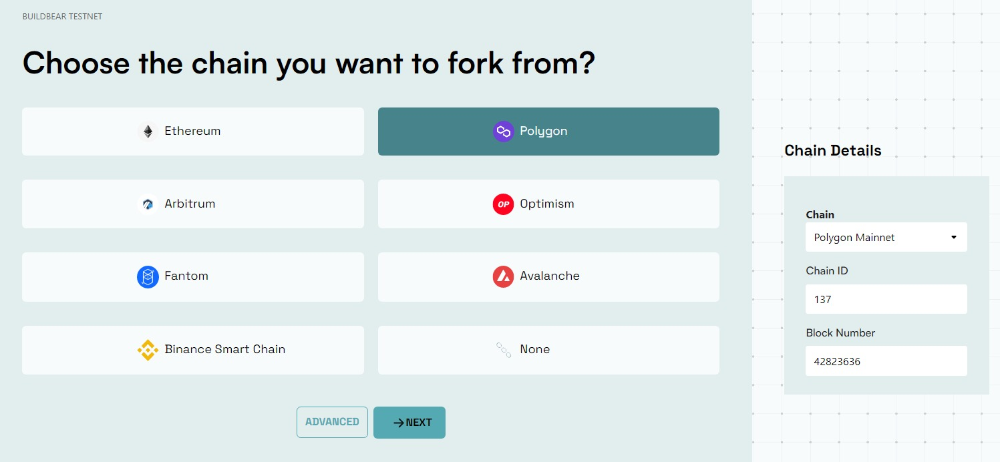
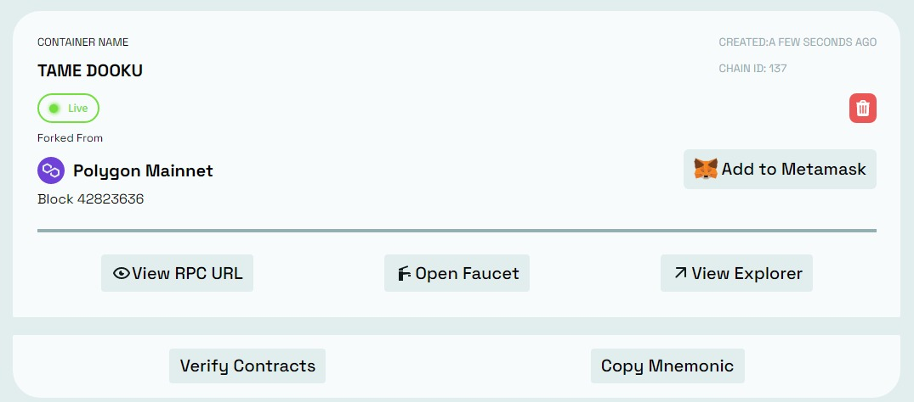
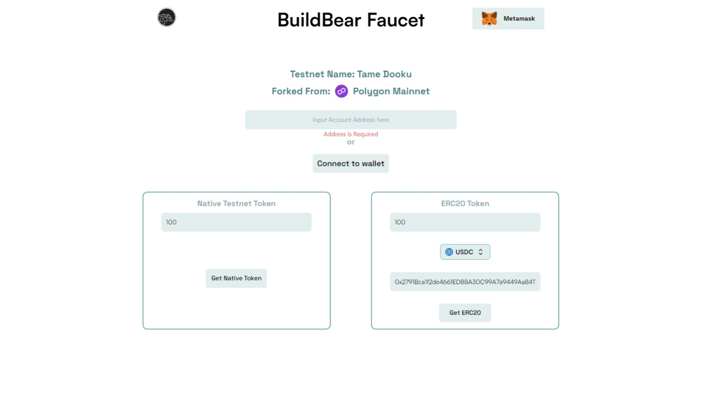
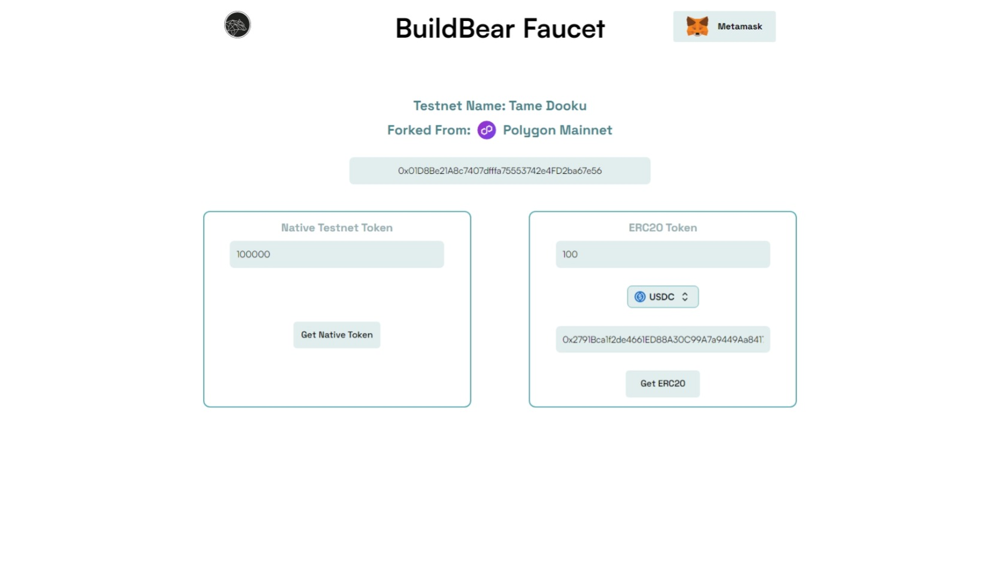
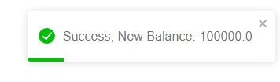
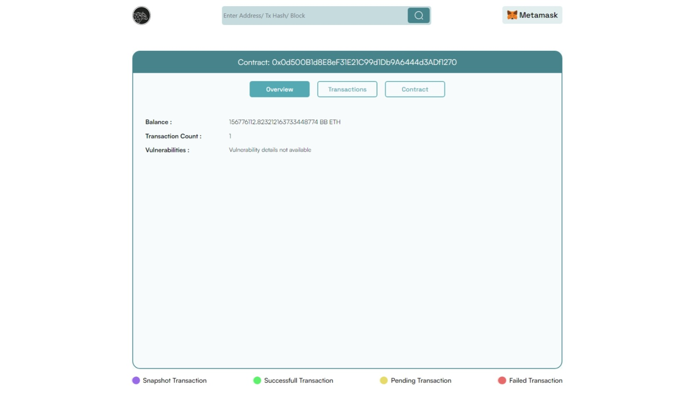
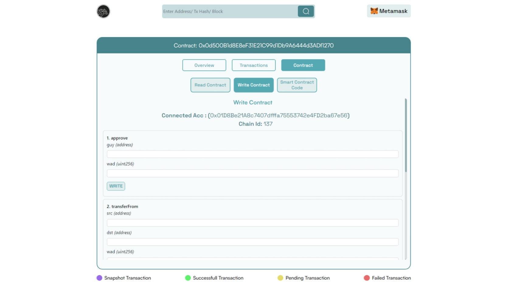
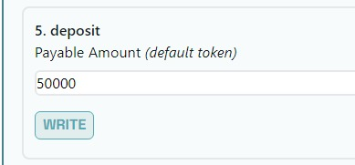
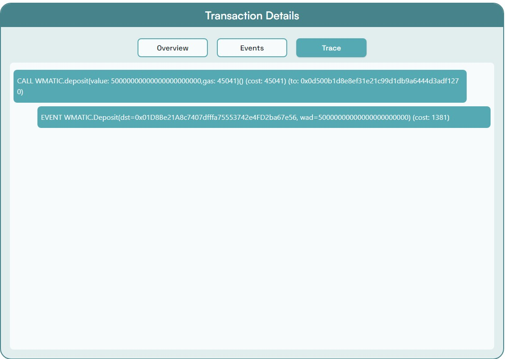

# Using Wrapped Matic Contract on the BuildBear’s Polygon Mainnet

Today, we are evaluating the strength of BuildBear’s Forked Mainnet strength to get play with the Wrapped Matic Contract.

**Action Plan**

1. Create a BuildBear Node from a Polygon Mainnet RPC
2. Get 100,000 (One Hundred Thousand Test Tokens; yes that is One HUNDRED THOUSAND) from the Faucet
3. Go to Wrapped Matic Contract
4. Call the `deposit` function

1. **Create a BuildBear Node from a Polygon Mainnet RPC**

(A) Visiting BuildBear ([https://home.buildbear.io/](https://home.buildbear.io/)) to create the node

(B) Click on `Create Testnet` , Select `Polygon Mainnet`, click on `Next` and then hit the `create` button right at the bottom of the screen

(C) You should see your Node come up, similar to the following:

1. **Get 100,000 (One Hundred Thousand Test Tokens; yes that is One HUNDRED THOUSAND) from the Faucet**

(A) Click on the `Open Faucet`, you should arrive at a page similar to the following:

(B) Use the `Add to Metmask` to add the network to your Metamask and connecting the wallet; then you will have the ability to choose your wallet address or for that matter any wallet address can be entered:

(C) Change the amount to 100,000 and select `Get Native Token` , you should get a success alert, like this:

1. **Go to Wrapped Matic Contract**

(A) Go back to [home.buildbear.io](http://home.buildbear.io) and click the `View Explorer`

<!--  -->

(B) Visit the Wrapped Matic Contract, in the Explorer: `0x0d500B1d8E8eF31E21C99d1Db9A6444d3ADf1270`

Your screen should be something similar to this:

(C) Go to the `Contract` tab and then `Write Contract` and `Connect to Web3:`

(D) Search for the `Deposit` function and enter the amount you would like, I did 50,000:

(E) Click `Write` ; Metamask should pop-up like this:

.png)

(F) That is it, `confirm` and you will have the Wrapped Matic.  Go to the transaction hash to see your transaction:

OPTIONAL: You can visit the `Trace` tab to see what happened in your transaction:

You can similarly interact with any contract on the Polygon Mainnet and see what you can do in a transaction.

Next up: we will be doing some swap transactions on Uniswap, to show you more on the power of BuildBear.