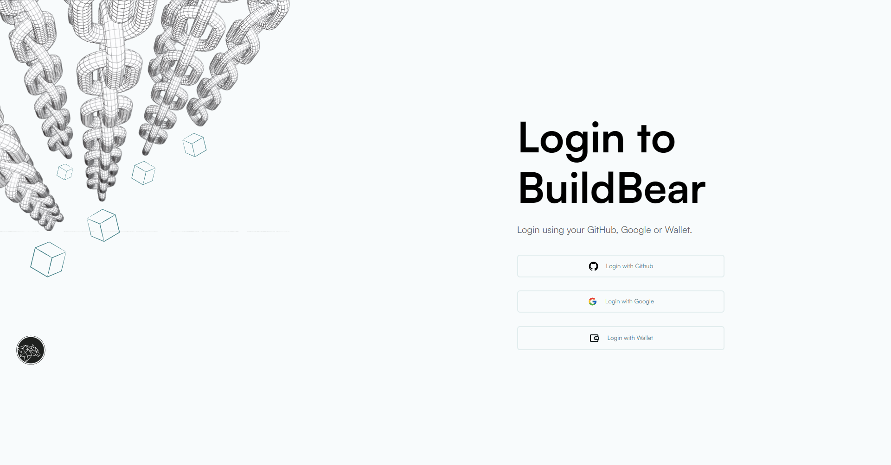

# Getting Started

BuildBear is a specialized platform for DApp development and testing. Developers can create a personalized Private Testnet sandbox for various EVM and EVM-compatible blockchain networks. 

**Key Features:**

- Enjoy a private faucet for unlimited Native and ERC20 token minting.
- Experience rapid transactions on BuildBear, completing in under 3 seconds.
- Effortlessly debug transactions within your sandbox using the built-in explorer and transaction tracer.
- Utilize the platform's tools for real-time testing and debugging.
- and many more advanced features.

## STEP 1: Sign in to the BuildBear Dashboard

**Sign in** with using your Github or Google or wallet.

Once you’re logged in, you will be able to see a page similar to the image below

Click the **Create BuildBear Testnet**  to start configuring your test blockchain.

.png)

A: Forking Options

As the name suggests, here you will have the ability to create your Private Testnet Sandbox, forked from the state of any of the supported chains.  Currently, we support the following:

1. Ethereum 
2. Polygon 
3. Polygon zkEVM 
4. Binance Smart Chain
5. Optimism
6. Fantom
7. Arbitrum
8. Avalanche 
9. Linea
10. Gnosis
11. Omni
12. Goerli Testnet
13. Sepolia Testnet
14. Arbitrum Goerli
15. Fantom Testnet
16. Avalanche 
17. Binance Smart Chain
18. Polygon Testnet
    

You can obviously create a test blockchain, without even forking from any existing chain.

If you have the need to create a testnet, forking from the state of any other public chain that we do not support, we request you to reach out to us at team@buildbear.io

## STEP 2: Your RPC Is all set for use!

Once you’ll hit the create button, you will be redirected back to the dashboard with your the details of your new private testnet Sandbox

.png)

While most of the information in the dashboard are self-explanatory, a few critical things to note:

1. **Unlocked Accounts**:
While creating your testnet Sandbox you will have the option (in Advanced options) to create the testnet Sandbox with Unlocked Accounts.  This is usually required if you are planning to run scripts on your testnet Sandbox.  You can choose to NOT have any unlocked accounts as well.  However, should you use to have unlocked accounts, they are created with randomly generated mnemonic.  You can get copy them from here, should you so need.

1. **Forked From**: 
This is a simple information on the fact if the testnet Sandbox was created using forking from the state of any public chain.

**Metamask** option will allow you to connect your RPC URL with your Metamak wallet with the help of just **one click.** 

Other then the above, you have your regular **RPC URL, Explorer, and Faucet.** 

## STEP 3: Add Native Tokens or ERC20 Tokens to your wallet

Go to the BuildBear dashboard and hit the **Open Faucet** option 

In order to perform transactions on any testnet Sandbox you will need the native tokens (for gasfees).  Use the faucet to get some of those.

You can also use the same faucet for ERC20 Tokens as well.  

Yes, you can also fund any other wallet address right from here.

## STEP 4: Add BuildBear network to your network in your config files 

On your BuildBear Dashboard click on the **Verify Contracts** and it it will give you the instructions that you must follow to update your network in the hardhat.config & foundry.toml file 

- For Hardhat [Follow this instructions](https://docs.buildbear.io/docs/Contract-Verification-on-BuildBear-using-Hardhat)
- For Foundry [Follow this instructions](https://docs.buildbear.io/docs/Contract-Verification-on-BuildBear-using-Foundry) 

Now, you can simply run any script using BuildBear network. 

## STEP 5: Check your transactions on BuildBear Explorer

Go to the BuildBear dashboard and hit the **Open Explorer** option 

You can also see the trace **of your transaction and can also decode **your transaction using the **advanced** option. 

You can perform as many transactions as you feel like and can use it for your web3 project! 

## STEP 6: Use Debug your Transactions

If you've verified the contract or it's already verified on Etherscan, any transactions you make with it will be broken down for a clear understanding, as shown below.

This is a simple example to help you see how it works. You can try more complicated transactions to explore the interactions between different smart contracts, function calls, passed parameters, used gas, delivered output, and more.

**Head Over to [BuildBear](http://buildbear.io) and create your own Private testnet Sandbox now!** 

## If you are facing any issues with BuildBear, feel free to report them to us at **[team@buildbear.io](mailto:team@buildbear.io)**