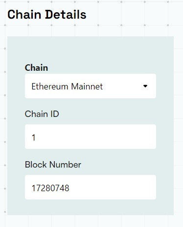

# Getting Started

BuildBear is a platform where the developer can create his / her own node and customize it according to the requirements. 

This platform provides you with the ease to perform testing at scale and with your entire team and keep understand what happens under the hood when you do your complicated blockchain transactions. 

In this article, we will learn how to create and use our own node using BuildBear. 

So without wasting any more time, Let us begin 🚀

## STEP 1: Sign in to the BuildBear Dashboard

In order to create a node, follow this [link](https://bit.ly/buildbear-dashboard) and **Log in** with using your Github or Google Account.

Once you’re logged in, you will be able to see a page similar to the image below

Click the **Create BuildBear Testnet**  to start configuring your test blockchain.

A: Forking Options

As the name suggests, here you will have the ability to create your private testnet, forked from the state of any of the supported chains.  Currently, we support the following:

1. Ethereum Mainnet
2. Polygon Mainnet
3. Binance Smart Chain
4. Optimism
5. Fantom
6. Arbitrum
7. Avalanche 
8. Goerli Testnet
9. Sepolia Testnet
10. Arbitrum Goerli
11. Fantom Testnet
12. Avalanche 
13. Binance Smart Chain
14. Polygon Testnet
    

You can obviously create a test blockchain, without even forking from any existing chain.

If you have the need to create a testnet, forking from the state of any other public chain that we do not support, we request you to reach out to us at team@buildbear.io

## STEP 2: Your RPC Is all set for use!

Once you’ll hit the create button, you will be redirected back to the dashboard with your the details of your new private testnet

While most of the information in the dashboard are self-explanatory, a few critical things to note:

1. **Unlocked Accounts**:
While creating your testnet you will have the option (in Advanced options) to create the testnet with Unlocked Accounts.  This is usually required if you are planning to run scripts on your testnet.  You can choose to NOT have any unlocked accounts as well.  However, should you use to have unlocked accounts, they are created with randomly generated mnemonic.  You can get copy them from here, should you so need.

1. **Forked From**: 
This is a simple information on the fact if the testnet was created using forking from the state of any public chain.

**Metamask** option will allow you to connect your RPC URL with your Metamak wallet with the help of just **one click.** 

Other then the above, you have your regular **RPC URL, Explorer, and Faucet.** 

## STEP 3: Add Native Tokens or ERC20 Tokens to your wallet

In order to perform transactions on any testnet you will need the native tokens (for gasfees).  Use the faucet to get some of those.

You can also use the same faucet for ERC20 Tokens as well.  More over here: [https://medium.com/buildbear/erc20-token-faucet-for-any-testnet-pre-mapped-and-custom-token-address-6ee6f3eda6e3](https://medium.com/buildbear/erc20-token-faucet-for-any-testnet-pre-mapped-and-custom-token-address-6ee6f3eda6e3)

Yes, you can also fund any other wallet address right from here.

## STEP 4: Add BuildBear network to your network in your config files 

For eg, for your hardhat.config you could simply click the Verify Contracts and it it will give you the instructions that you must follow to update your network in the hardhat.config file 

Now, you can simply run any script using BuildBear network. 

## STEP 5: Check your transactions on BuildBear Explorer

Go to the BuildBear dashboard and hit the **open explorer** option 

You can also see the trace **of your transaction and can also decode **your transaction using the **advanced** option. 

You can perform as many transactions as you feel like and can use it for your web3 project! 

## STEP 6: (Optional and Advanced) Use Debug your Transactions

In order to understand what transpired, at the blockchain level, in your transactions, go back to the BuildBear Dashboard and click on the `Verify Contracts` and then submit the “artifacts” folder from your project folder. (This is only for your contracts).  *{If you have forked from a public blockchain and those contracts are verified, you do NOT need to do this step for those contracts}*

Once done, you can actually deconstruct your transactions on BuildBear Explorer by clicking on the **Advance** option.

You should see your something similar to the image below:

 

This is one of the most simple example just to demonstrate.  Feel free to do complex transactions and see the interactions between different smart contracts, function calls, parameters passed, gas used, output delivered and much more.

**To get started with BuildBear, click on [this link](http://buildbear.io) and create your own testnet now!** 

## If you are facing any issues with BuildBear, feel free to report them to us at **[team@buildbear.io](mailto:team@buildbear.io)**